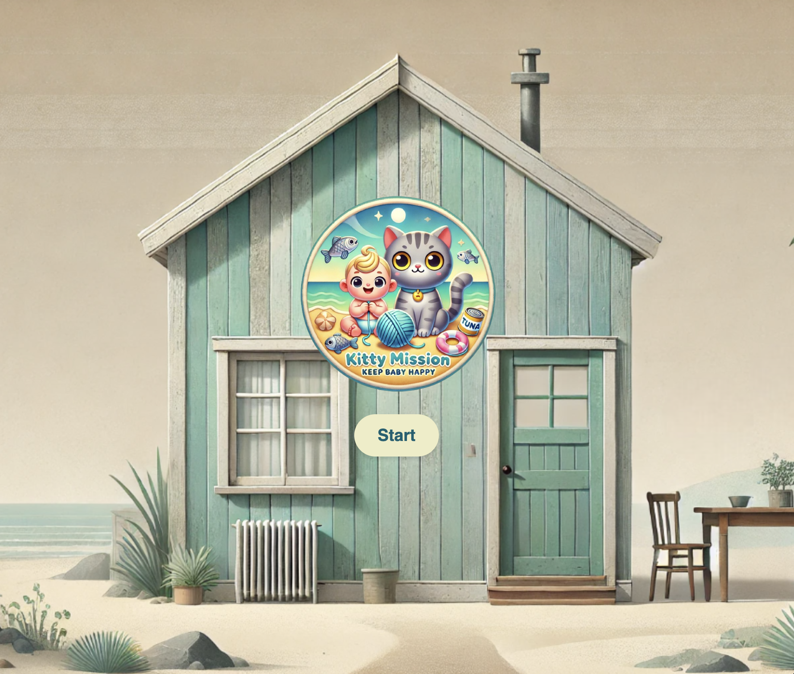

# Kitty Mission: Keep Baby Happy

## Table of Contents

- [Overview](#overview)
- [Backstory](#backstory)
- [How to Play](#how-to-play)
- [Game Rules](#game-rules)
- [Controls](#controls)
- [Technologies Used](#technologies-used)

## Overview

**Kitty Mission: Keep Baby Happy** is a fast-paced, quirky browser game starring **Sashi the Cat**, and set inside a beach-house. Your objective is simple but challenging: **collect as many points as possible** by gathering treats and shooting obstacles, all while avoiding a game over!

## Backstory

Meet Sashi, a self-centered yet lovable cat with a mission: keep the baby happy! Between dashing around, gathering treats, and tackling obstacles, Sashi can earn points and keep the baby entertained. However, games—obstacles get in the way, and if Sashi takes too many hits, the baby won’t be too happy!

With each treat and obstacle Sashi manages to shoot, your points will rack up!

## How to Play

You can play the game online, hosted for free on GitHub Pages. [Click here to play Kitty Mission: Keep Baby Happy](https://edvigedev.github.io/kitty-mission-keep-baby-happy/).

## Game Rules

In **Kitty Mission: Keep Baby Happy**, the main goal is to **accumulate as many points as possible** by:

1. **Collecting Treats** (fish, cat toys, and hearts) - Each treat gives Sashi a point.
2. **Shooting Obstacles** (chocolate, coffee, and panettone) - Shooting obstacles doubles the points and shatters them into small particles.

However, each hit from an obstacle costs Sashi a life. If Sashi loses all lives, the game ends. You’ll see your final stats and best scores on the game-over screen.

Additionally:

- **Collect Baby Smiley Faces** to restore one life (if Sashi is missing a life). If all lives are intact, they’ll add one score point instead.

### Game Over

When Sashi loses all lives, the game ends, displaying the **final score and stats** alongside a list of the **highest scores**. You can reset the game from the game-over screen.

## Controls

- **Movement**: Use the **Arrow Keys** to move Sashi up, down, left, or right.
- **Shooting Diapers**: Press **Spacebar** to shoot diapers at obstacles.

  **Note**: Shooting obstacles grants double points and causes them to shatter into particles.

## Game Mechanics

- **Collision with Obstacles**: If Sashi collides with an obstacle, he loses a life, accompanied by an “angry cat” sound effect. Losing all lives ends the game.
- **Shooting Obstacles**: Shooting an obstacle breaks it into particles, removes it from the screen, and grants double points.
- **Collecting Treats**: Each treat Sashi collects gives him one point.
- **Baby Smiley Faces**: Restore a life if missing, or add a point if lives are full, accompanied by a playful baby laugh sound.

## Technologies Used

- **JavaScript** for game logic and interactivity
- **CSS** for styling and animations
- **HTML** for structuring the game

## Future Enhancements

Some potential improvements include adding levels, new obstacles, or power-ups that grant Sashi temporary abilities, like invincibility or speed boosts.
